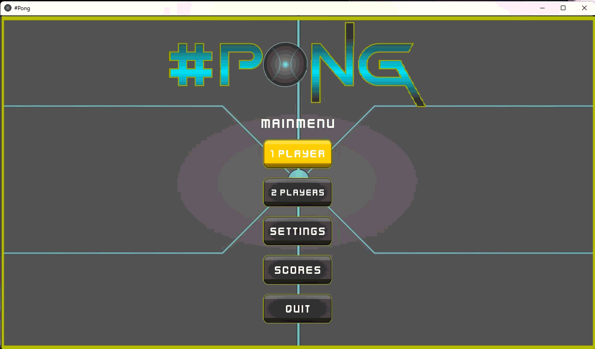

## Personal revisit of a classic game.

### The short story
Always wanted to do a little of Gamedev so one day I started...

At first I've coded that game using Godot Engine and C#.
Finally I wasn't happy with the final result. The game was complete but wanted to improve things and after some tries with the Godot and the Unity engines, I have decided to rewrite it from scratch using C++ and a library.

I have chosen SFML 3.

Actually the game is a WIP and there is the plan : 

- [x] A game for 1 player
- [x] A 2 players mode on the same screen
- [ ] 2 playing modes 
- [x] A complete settings system
- [ ] High Scores for an "Endurance mode"

Maybe
- [ ] A online 2 players mode

### Main menu screen

### In game screens

### Quick preview

